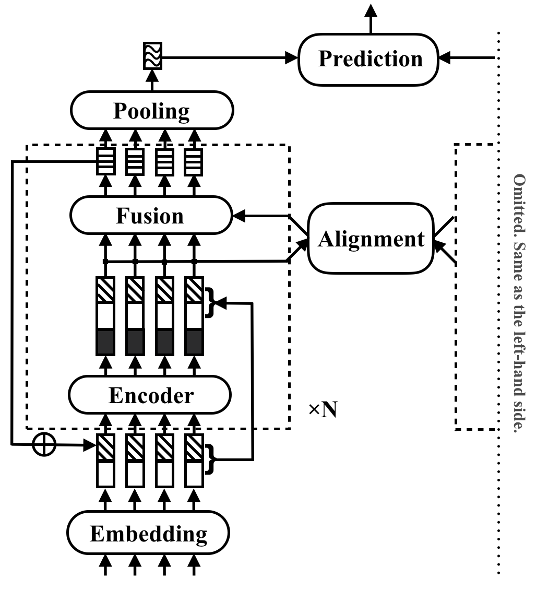

#为提高推理速度优化代码，并在中文语料上复现RE2模型
#目前是以point—wise的方式训练的，适合召回；如果想用于重排序，最好用pair-wise方式训练模型。

This is the Tensorflow implementation for Chinese corpus of the ACL 2019 paper [Simple and Effective Text Matching with Richer Alignment Features](https://www.aclweb.org/anthology/P19-1465). Pytorch implementation: https://github.com/alibaba-edu/simple-effective-text-matching-pytorch.
Up to now, based on Chinese corpus LCQMC. Use Chinese character vector.

if you want to demo, please use commant such as "python demo.py configs/main.json5  wzk  benchmark-0"
## Quick Links

- [About](#simple-and-effective-text-matching)
- [Setup](#setup)
- [Usage](#usage)

## Simple and Effective Text Matching

RE2 is a fast and strong neural architecture for general purpose text matching applications. 
In a text matching task, a model takes two text sequences as input and predicts their relationship.
This method aims to explore what is sufficient for strong performance in these tasks. 
It simplifies or omits many slow components which are previously considered as core building blocks in text matching.
It achieves its performance by a simple idea, which is keeping three key features directly available for inter-sequence alignment and fusion: 
previous aligned features (**R**esidual vectors), original point-wise features (**E**mbedding vectors), and contextual features (**E**ncoder output).

RE2 achieves performance on par with the state of the art on four benchmark datasets: SNLI, SciTail, Quora and WikiQA,
across tasks of natural language inference, paraphrase identification and answer selection 
with no or few task-specific adaptations. It has at least 6 times faster inference speed compared with similarly performed models.

<p align="center"></p>

The following table lists major experiment results. 
The paper reports the average and standard deviation of 10 runs and the results can be easily reproduced. 
Inference time (in seconds) is measured by processing a batch of 8 pairs of length 20 on Intel i7 CPUs.
The computation time of POS features used by CSRAN and DIIN is not included.


Refer to the paper for more details of the components and experiment results.

## Setup

- install python >= 3.6 and pip
- `pip install -r requirements.txt`
- install Tensorflow 1.4 or above (the wheel file for Tensorflow 1.4 gpu version under python 3.6 can be found 
[here](https://mirrors.tuna.tsinghua.edu.cn/tensorflow/linux/gpu/tensorflow_gpu-1.4.1-cp36-cp36m-linux_x86_64.whl))


## Usage

To train a new text matching model, run the following command: 

```bash
python train.py $config_file.json5
```

Example configuration files are provided in `configs/`:

- `configs/main.json5`: replicate the main experiment result in the paper.
- `configs/robustness.json5`: robustness checks
- `configs/ablation.json5`: ablation study

The instructions to write your own configuration files:

```json5
[
    {
        name: 'exp1', // name of your experiment, can be the same across different data
        __parents__: [
            'default', // always put the default on top
            'data/quora', // data specific configurations in `configs/data`
            // 'debug', // use "debug" to quick debug your code  
        ],
        __repeat__: 5,  // how may repetitions you want
        blocks: 3, // other configurations for this experiment 
    },
    // multiple configurations are executed sequentially
    {
        name: 'exp2', // results under the same name will be overwritten
        __parents__: [
            'default', 
            'data/quora',
        ],
        __repeat__: 5,  
        blocks: 4, 
    }
]
```

To check the configurations only, use

```bash
python train.py $config_file.json5
```

## Citation

Please cite the ACL paper if you use RE2 in your work:

```
@inproceedings{yang2019simple,
  title={Simple and Effective Text Matching with Richer Alignment Features},
  author={Yang, Runqi and Zhang, Jianhai and Gao, Xing and Ji, Feng and Chen, Haiqing},
  booktitle={Association for Computational Linguistics (ACL)},
  year={2019}
}
```

## License
RE2 is under Apache License 2.0.
